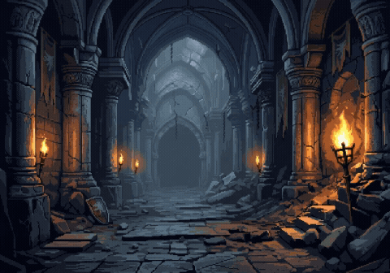
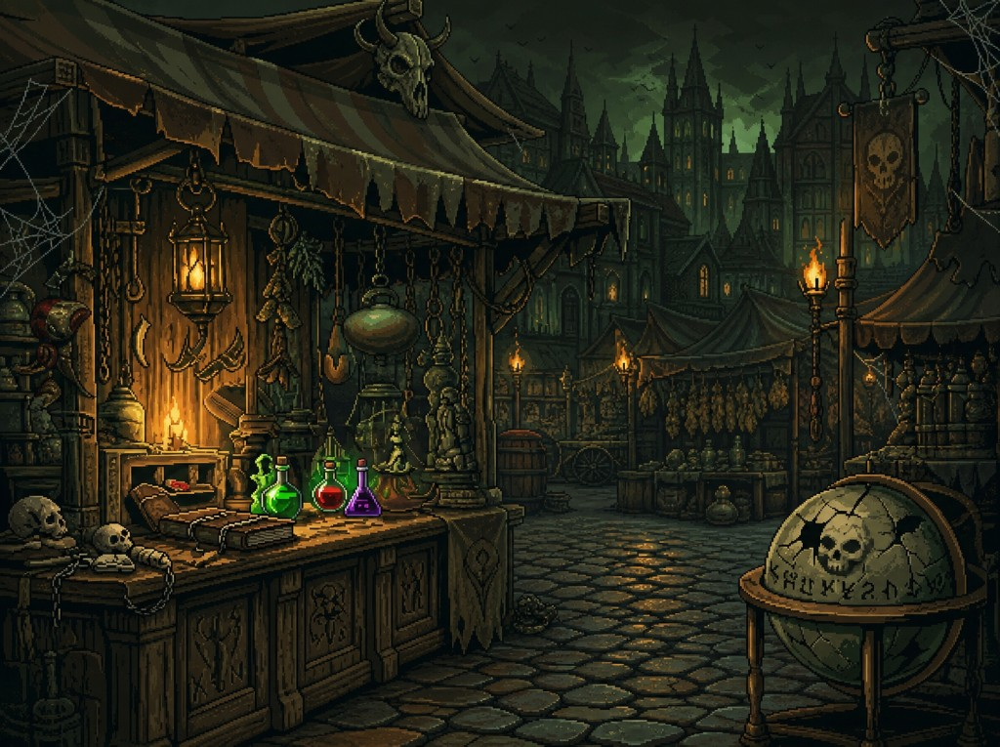
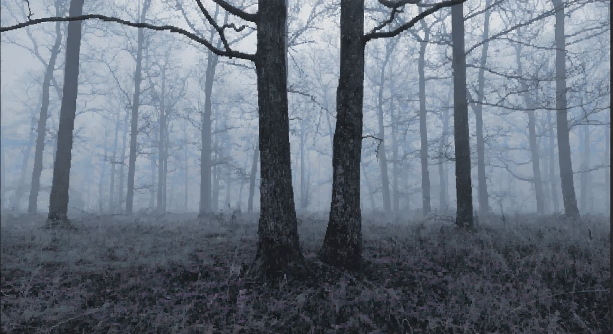

<h1 align="center">THE WITCHER</h1>
<h3 align="center">Chapter 1 — Pixel Prototype</h3>

<p align="center">
  <strong>Лавка герцога · петля времени · первый босс — Волк</strong><br>
  Java · Swing · pixel-art · MVP
</p>

<p align="center">
  
  
  
</p>

<p align="center">
  
</p>

<p align="center">
  
  &nbsp;
  
</p>

---

## Скачать и играть

### [⬇ Download Windows (.ZIP) — v1.1.0](https://github.com/top-secret666/the-witcher/releases/download/v1.1.0/The-Witcher-v1.1.0-Windows.zip)

| Шаг | Что сделать |
|:---:|:------------|
| **1** | Скачай ZIP по ссылке выше |
| **2** | Распакуй архив |
| **3** | Открой папку `The-Witcher` и запусти **`The Witcher.exe`** |

Java отдельно ставить **не нужно** — рантайм внутри сборки.  
Держи рядом: `The Witcher.exe`, `app/`, `runtime/`.

Если прямая ссылка не открывается — файл лежит в [**Releases**](https://github.com/top-secret666/the-witcher/releases).

---

## О проекте

> *«Снова лавка. Снова герцог. Снова ты — без памяти и без выхода… пока не встретишь Волка.»*

Первый серьёзный pet-project: **визуальная новелла** (не полноценный хоррор) — глава 1 с лавкой брони, VN-диалогами и боссом-Волком.

**В прототипе:**

- **Лавка** — покупки, экипировка, инвентарь, кошелёк, музыка
- **Петля** — пробуждение, карта, брифинг
- **Волк** — лес → вспышка с Весемиром → глитч-финал → титры
- **Пауза / настройки** — громкость, скорость текста
- **Терминал** — скрытый путь к карте боссов

---

## Архитектура

```
View (Swing)  →  Presenter  →  Chapter1Director  →  Domain  →  Model
```

| Слой | Роль |
|:-----|:-----|
| **UI** | `dev/src/.../ui/` — кадр, ввод, ассеты |
| **Presenter** | Связка экрана с фазами главы |
| **Director** | Фазы и переходы |
| **Domain** | Бой, петля, лавка, VN |

Канон прохождения: [`docs/chapter1_journey_checklist.md`](docs/chapter1_journey_checklist.md)

---

## Структура репозитория

```
the-witcher/
├── README.md
├── docs/                 дизайн, диалоги, чеклист
│   └── media/            картинки для README
└── dev/                  исходники + tools (сборка exe)
    ├── src/              игра
    └── tools/            package-exe, release zip/upload
```

Бинарники **не** в git — только через [**GitHub Releases**](https://github.com/top-secret666/the-witcher/releases).

Локальный мусор (`out/`, `app/`, `runtime/`, корневые `.png`/`.mp4`, crash-логи) в `.gitignore`.

---

## Для разработчиков

**Нужно:** JDK 17, Windows

```powershell
powershell -ExecutionPolicy Bypass -File dev\tools\package-exe.ps1
python dev\tools\make_release_zip.py --version 1.1.0
python dev\tools\publish_release_api.py 1.1.0
```

Не коммить `The Witcher.exe`, `app/`, `runtime/`.

---

## Документы

| Файл | Описание |
|:-----|:---------|
| [`chapter1_journey_checklist.md`](docs/chapter1_journey_checklist.md) | Канон главы 1 |
| [`glava1_scenariy_volk.md`](docs/glava1_scenariy_volk.md) | Сценарий Волка |
| [`dialogues.md`](docs/dialogues.md) | Черновик диалогов |
| [`design/`](docs/design/) | Дизайн петли |

---

<p align="center">
  <sub>
    Pet project · Dana Stukalova · VGTU · 2025–2026<br>
    <a href="https://github.com/top-secret666/the-witcher/releases">Releases</a>
    ·
    <a href="docs/chapter1_journey_checklist.md">Playthrough</a>
  </sub>
</p>
