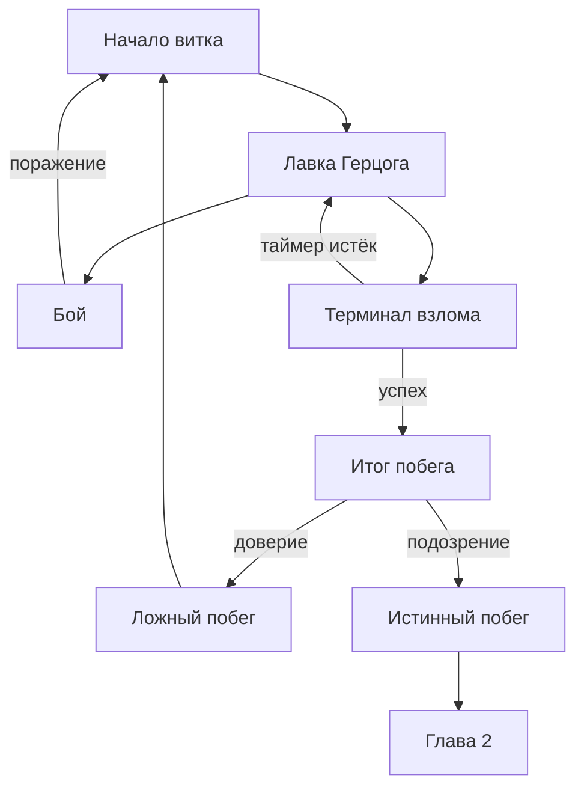
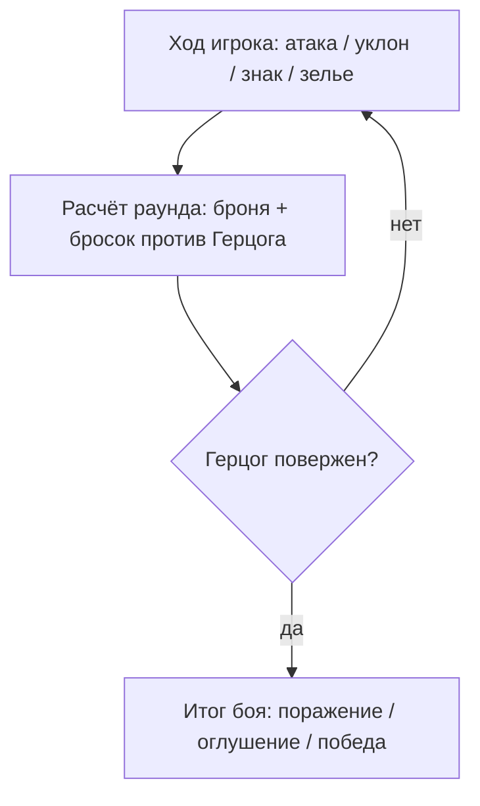
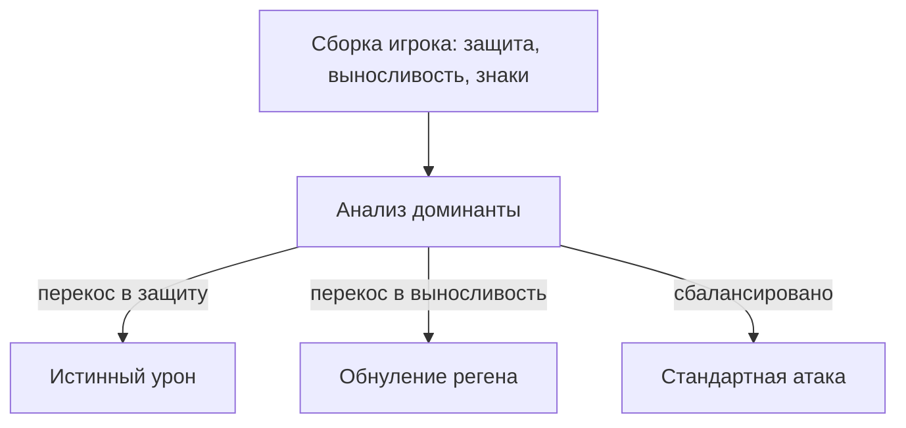
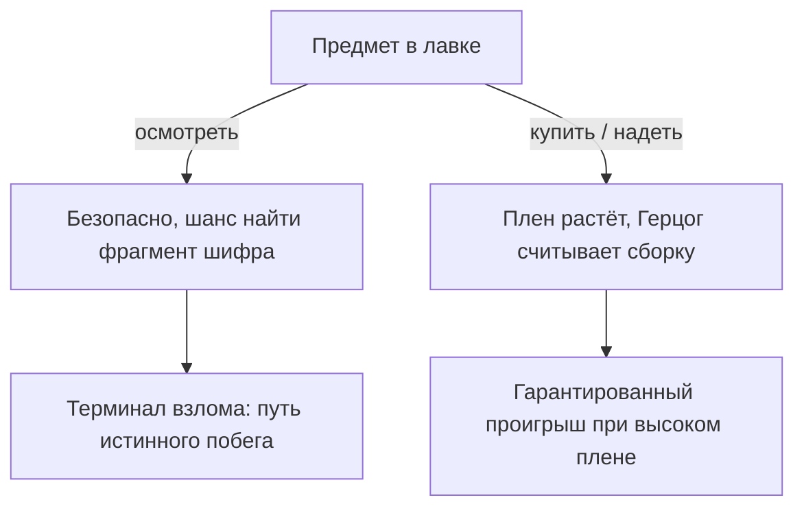
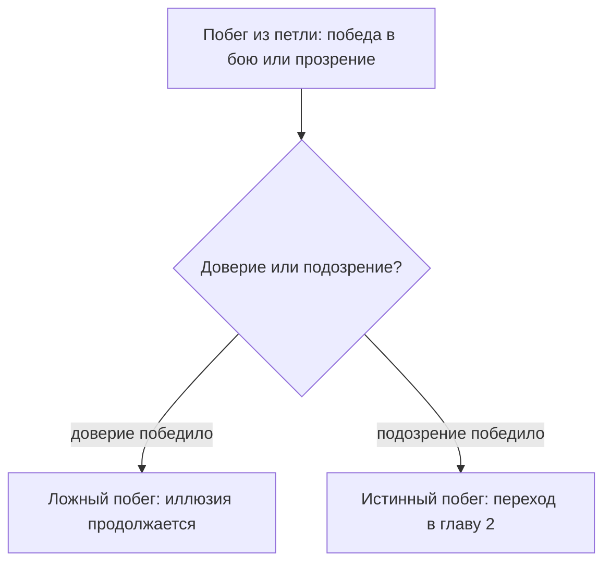

# Глава 1: «Петля Герцога» — дизайн-документ

## Общая концепция

Первая глава — маленькая визуальная новелла с боевой системой. Геральт заперт в иллюзии Герцога (замок Арнскрон), которая внешне выглядит как лавка со снаряжением и бой с боссом. Игрок должен пройти цикл («виток»), чтобы найти способ вырваться. Любой проигрыш возвращает игрока в начало витка — с сохранённым прогрессом, но без выхода из петли.

Технически: прототип разрабатывается на Swing, логика пишется отдельно от отрисовки, чтобы позже перенести на LibGDX без переписывания с нуля. Глава 2 будет отдельным проектом на Unity (2.5D открытый мир), связанным с главой 1 только сюжетно — без переноса сохранений между движками.

---

## Ключевые счётчики

| Счётчик | Растёт от | Влияет на |
|---|---|---|
| **Виток** | каждого проигрыша боя | сложность подбора брони Герцогом |
| **Плен** | каждой покупки/экипировки предмета | доступность зеркального контрприёма Герцога, шанс победы в бою |
| **Подозрение** | ответов в диалогах, выбранных с недоверием к Герцогу | частота и интенсивность глюков иллюзии; доступ к терминалу взлома; итоговая концовка |
| **Доверие** | ответов в диалогах, выбранных с доверием | итоговая концовка (противовес подозрению) |
| **Фрагменты шифра** | найдены при осмотре конкретных предметов | доступность терминала взлома |

Подозрение/Доверие и Плен/Фрагменты — независимые пары. Первая пара отвечает за хоррор-давление и итоговую концовку, вторая — за геймплейный прогресс (доступ к терминалу и провал в бою).

---

## Лавка Герцога

У игрока на каждый предмет два действия:

- **Осмотреть** — бесплатно, безопасно. Небольшой шанс найти фрагмент шифра (только у 4 конкретных предметов: кираса, штаны, перчатки, сапоги — по порядку, в котором они и так идут в интерфейсе лавки).
- **Купить / экипировать** — увеличивает счётчик «Плен». Чем больше плена, тем точнее Герцог считывает сборку игрока и подбирает контрприём в бою (см. ниже). При достаточном плене победа в бою становится математически недостижимой.

Реплика Герцога «Не стесняйтесь, если просто смотрите — смотрите сколько угодно» — уже заложенная в интерфейс подсказка именно этой механики.

---

## Бой: зеркальный противник

Формула раунда:

```
результат_игрока = (защита + выносливость) × модификатор_действия + бросок(1..6)
атака_герцога     = базовая_атака_уровня × модификатор_витка
```

Действия игрока (Command-паттерн): **Атака**, **Уклон**, **Знак**, **Зелье** — каждое со своим модификатором.

Герцог анализирует доминирующую характеристику сборки игрока и подбирает контрприём:

- Перекос в защиту → атака **игнорирует защиту** (истинный урон).
- Перекос в выносливость → атака **обнуляет регенерацию выносливости**.
- Сбалансированная сборка → стандартная атака, без явного контрприёма.

Уровни сложности (тиры) через `BattleTier` (Low / Mid / High):

- Низкий — Герцог сильнее стартовой брони, поражение гарантировано честно, через цифры.
- Средний — Герцог не может быть побеждён (`canBeDefeated = false`), но может быть «оглушён».
- Высокий — при достаточно сильной броне теоретически может быть побеждён, но при высоком плене контрприём всё равно не даёт победить (см. терминал ниже как альтернативный путь).

---

## Терминал взлома

Открывается, когда одновременно выполнены два условия: достаточный уровень **Подозрения** и достаточное число собранных **Фрагментов**.

- Спрятан в интерфейсе как скрытый элемент (например, «за картой»/скрытая опция меню).
- Работает как консоль с посимвольным выводом (переиспользует уже написанный `ConsoleUI`/`typeText`).
- Белый список команд: `HELP`, `SCAN`, `DECRYPT <фрагмент>`, `UNLOCK`, `EXIT`.
- **Ограничение по времени**: пока идёт ввод, Герцог «долбится» в дверь — таймер, интенсивность глюков растёт по мере истечения времени.
- **Один заход = одна попытка**, но при неудаче (таймаут) игрока просто выкидывает из терминала обратно в лавку — фрагменты не теряются, теряется только сам заход. Автосохранение фиксирует прогресс, чтобы провал не ощущался как наказание за исследование.
- `SCAN` при неудачной попытке может выдать частичную подсказку («порядок имеет значение, Белый Волк»), не раскрывая решение целиком.

### Шифр

- Фрагменты спрятаны в описаниях четырёх конкретных предметов: кираса, штаны, перчатки, сапоги — видны только при достаточной осознанности (лёгкий текстовый глюк-эффект отличает их от обычных описаний).
- Ключ — **порядок**, в котором эти предметы идут в интерфейсе лавки (игрок видел его весь прототип, но не как код).
- Финальная команда собирается из фрагментов в этом порядке, например:

```
BREAK_LOOP(<фрагмент кирасы>, <фрагмент штанов>, <фрагмент перчаток>, <фрагмент сапог>)
```

- Проверка — простое сравнение строк, никакой настоящей криптографии не требуется.

### Переход в главу 2

После верной команды — терминал выводит несколько строк псевдо-boot-лога («инициализация... загрузка мира... компиляция реальности...»), экран уходит в шум/глюк, под прикрытием которого происходит переключение на сборку главы 2 (Unity). Ощущается как «игрок взломал саму игру», по факту — красиво замаскированный переход между сценами/движками.

---

## Финальная развилка: истинный и ложный побег

Успешный взлом терминала даёт только **право на попытку побега** — не гарантирует его. Решает финальный диалог с Герцогом и то, что перевесило за всю игру — Подозрение или Доверие:

| Доминанта | Результат |
|---|---|
| Подозрение | **Истинный побег** — переход в главу 2 |
| Доверие | **Ложный побег** — иллюзия продолжается, игрок остаётся в петле |

При ложном побеге — не полный сброс: сохраняется купленная броня и часть подозрения, но Герцог заметно «подкручивает» иллюзию (меняется деталь окружения, новая реплика вроде «не в этот раз, Белый Волк») — подтверждая игроку, что это осознанная часть системы, а не баг.

---

## Архитектурные заметки (для отчёта/защиты)

- **State** — состояния главы: `ShopState`, `BattleState`, `HackConsoleState`, `EscapeState`.
- **Command** — единый интерфейс для действий игрока и в бою (`PlayerAction`: Attack/Dodge/Sign/Potion), и в терминале (`HackCommand`: Decrypt/Scan/Unlock) — одна архитектурная идея в двух контекстах.
- **Observer** — глюки/визуальные эффекты подписаны на изменение счётчика Подозрения и сами решают, когда сработать, а не жёстко зашиты в код рендера.
- Логика (счётчики, формулы, состояния) отделена от отрисовки — чтобы перенос на LibGDX позже не требовал переписывания игровой механики, только слоя рендеринга.

---

## Схемы

### Полная схема системы главы 1



### Раунд боя



### Зеркальный противник



### Осмотр против покупки



### Истинный и ложный побег



---

## Открытые вопросы (на потом)

- Точные пороги: сколько витков до какого уровня осознанности, сколько плена нужно для «контрприёма», сколько времени даёт таймер терминала.
- Конкретные реплики Герцога — для диалогов, для двери во время взлома, для сцен ложного побега.
- Стартовые числовые значения брони и базовые атаки Герцога по тирам.
