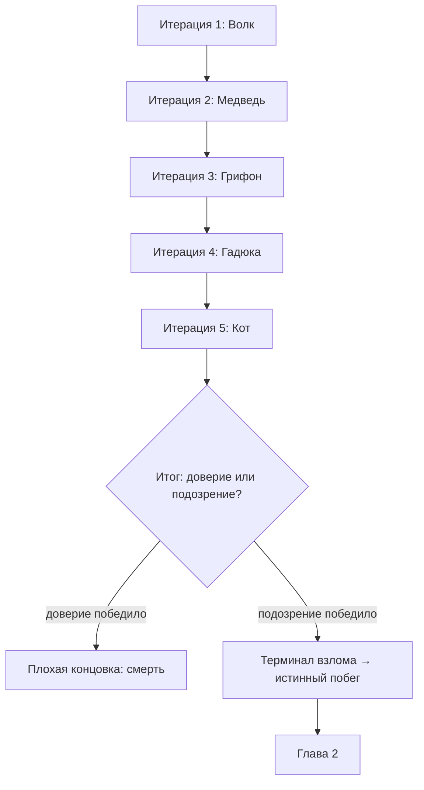
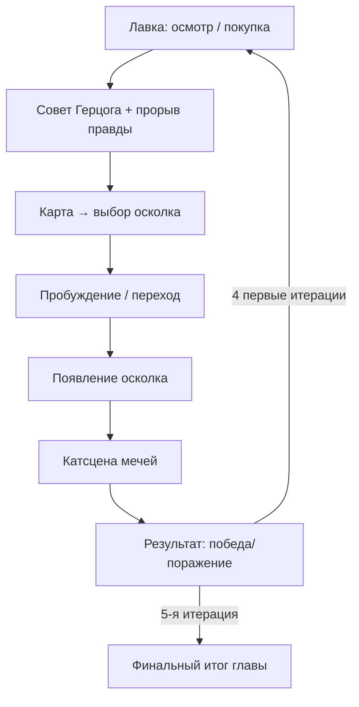
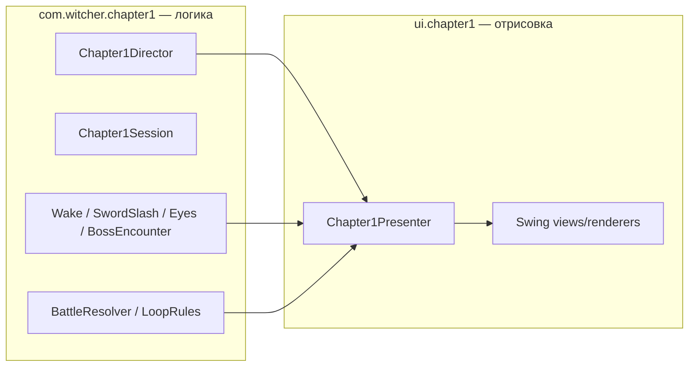

# Глава 1: «Пять осколков» — лор, сюжет и структура (обновление)

Этот документ дополняет `glava1_dizain_petli.md` (базовая механика петли, лавка, терминал взлома). Здесь — новый слой, добавленный поверх: пять фиксированных итераций, где каждый босс оказался частью психики самого Геральта, а не отдельным персонажем.

---

## Ключевая идея

Геральт не сражается с внешними врагами в плену Герцога. Герцог **расщепил его собственную психику на пять осколков**, одев каждый в броню одной из ведьмачьих школ — и заставил Геральта сражаться с самим собой, чтобы удержать его в иллюзии. Победа в буквальном бою не освобождает — освобождает **узнавание себя** в каждом осколке.

Это меняет смысл всей главы: не побег из тюрьмы, а собирание себя обратно по кускам.

---

## Пять осколков

| Школа | Психологический смысл осколка | Ложный совет Герцога (стат) | Что на самом деле нужно | Тон прорыва истинного «я» |
|---|---|---|---|---|
| **Волк** | Истинное «я» — память о Каэр Морхен, о доверии, о семье до иллюзии | нет — совет честный | совет и есть решение | спокойный, тёплый |
| **Медведь** | Одиночество — «больше никого не подпускать» | Защита | Атака/уклон | грубый, рычащий |
| **Грифон** | Маска приличия — этикет вместо искренности | Знаки | Сталь | вежливый → резкий обрыв |
| **Гадюка** | Стыд — moments, когда пришлось переступить через принципы | Уклонение/скрытность | Прямая атака | загадочный, метафоричный |
| **Кот** | Подавленные эмоции — то немногое, что прорвалось сквозь мутации | Выносливость | Зелье / иное | истеричный, обрывочный |

**Порядок открытия:** Волк → Медведь → Грифон → Гадюка → Кот (фиксированная цепочка, каждый следующий открывается после предыдущего).

**Важно про IP:** личности не привязаны к именованным каноническим персонажам серии (Летто, Весемир и т.д.) — это оригинальные осколки психики главного героя, только одетые в узнаваемую символику школ. Броня переосмыслена по принципам школы (палитра, силуэт), а не скопирована с игр 1-в-1.

---

## Механика «правда внутри лжи»

Герцог перед каждым боем даёт совет, который почти всегда — ловушка (усиливает зеркальный контрприём и провоцирует ненужную покупку → рост Плена). Но **внутри его реплики** на 200–300 мс прорывается голос настоящего осколка с реальной подсказкой — рендерится с точечным глюк-эффектом текста, не всей фразы целиком.

Пример (Медведь):

> Герцог: «Медведь? Тогда качайте защиту, поверьте мне — крепкий панцирь спасёт вас от —… **не верь ему, беги, бей в спину, у него нет** — от любого удара, не сомневайтесь».

Технически — одна строка `DukeLines` с встроенным маркером стиля для куска текста, никакой новой UI-сущности не требуется (переиспользуется существующий посимвольный `typeText`).

**Модель данных:**

```java
record BossPersona(
    String name,              // "Медведь"
    String location,
    String misleadingAdvice,  // "DEFENSE"
    String trueHintStat,      // "ATTACK"
    String trueHintText,      // фраза-прорыв
    String psycheMeaning      // для справки нарративного дизайна
)
```

Школа Волка — исключение: `misleadingAdvice == trueHintStat`, совет честный целиком.

---

## Структура главы: 5 фиксированных итераций + ветка смерти

Раньше петля была условно бесконечной. Теперь — ровно 5 итераций (по числу осколков), после чего наступает развязка.



**Переосмысление Доверие/Подозрение:** это больше не «веришь Герцогу или нет» — это отношение Геральта **к самому себе**.

- **Доверие** — Геральт продолжает верить искажённой версии себя, которую слепил Герцог, отвергает осколки как чужих врагов → саморазрушение, смерть как метафора отрицания себя.
- **Подозрение** — Геральт узнаёт в каждом осколке часть себя, собирает их воедино → целостность → истинный побег.

**Итерации 1–4 всегда заканчиваются продолжением цикла** (это не проверка на смерть — она наступает только один раз, после пятой итерации, по итоговому счёту за всю главу). Постоянные глюки/намёки «вали отсюда» нарастают на протяжении всех пяти итераций через счётчик Подозрения, как и раньше.

---

## Один виток (внутри каждой итерации)

Технически — та же цепочка, что уже реализована в коде (см. раздел «Статус реализации» ниже), просто параметризована текущей `BossPersona`:



---

## Статус реализации (по коду на текущий момент)

Уже готово и работает как единый пайплайн (Swing-прототип):



- Логика (`chapter1/`) полностью отделена от Swing-отрисовки (`ui/chapter1/`) — перенос на LibGDX позже потребует переписать только слой отрисовки.
- Карта осколков открывается по клику из инвентаря после первой экипировки.
- Победа в бою пока считается по простой формуле `defense + stamina + signs >= 6` — **это заглушка**, которую нужно заменить на настоящую механику Плена/зеркального противника (см. `glava1_dizain_petli.md`) на Этапе C плана.
- Мертвые/дублирующие фазы (`BOSS_SPLASH`, старый `VN_BATTLE`) ещё не расчищены — Этап A плана.

**Рекомендованный порядок:** сначала расчистка канонического пути (Этап A), потом полировка VFX мечей (Этап B), потом привязка исхода к настоящей механике Плена и добавление 5 фиксированных итераций с веткой смерти (Этап C), и только затем перенос на движок (Этап D).

---

## Ассеты и катсцены — итоговый подход

Отказались от идеи лицензировать клипы сериала Netflix «Ведьмак» — дорого и юридически неудобно для студенческого проекта. Вместо этого:

| Тип контента | Источник |
|---|---|
| Пробуждение (POV, взгляд вверх на кроны деревьев) | бесплатное стоковое видео (Pexels) |
| Тревожный лес / «что-то не так» | бесплатное стоковое видео (Pexels) |
| Замок/лес атмосферные вставки | Pixabay, раздел dark fantasy |
| Катсцена боя (столкновение клинков) | процедурная генерация в коде (`Path2D`, вспышка, искры) **или** референс на технику Hollow Knight — рукописный силуэт, чернильная текстура, покадровые ключевые позы вместо гладкого видео |
| Моргание/веки | процедурная анимация кривыми Безье (`quadTo`), без спрайтов |
| Глюк-оверлеи | генерируются отдельно, 3 уровня интенсивности (light/medium/heavy) |
| Загрузочный экран | лёгкая пасхалка — кот, играющий на пианино, с лифтовой музыкой (royalty-free, Pixabay Music) |

**Правило по броне школ:** переосмысление канонических принципов школы (палитра, силуэт, символика), не копирование конкретных моделей брони из игр 1-в-1 — важно и для оригинальности проекта, и для избежания прямого визуального заимствования чужой IP.

---

## Открытые вопросы (на потом)

- Точные пороги Подозрения/Плена для каждой из 5 итераций — растут ли линейно или у каждого осколка свой профиль сложности.
- Полные диалоги (обычная реплика + прорыв правды) для всех пяти школ — пока расписан только принцип и пример для Медведя.
- Как визуально показать «собирание» осколков в финальной сцене истинного побега — отдельная катсцена или постепенное изменение портрета Геральта на экране результата по ходу пяти итераций.
- Палитра и промты для брони оставшихся школ (Медведь, Грифон, Гадюка, Кот) — пока детально проработана только школа Волка.
