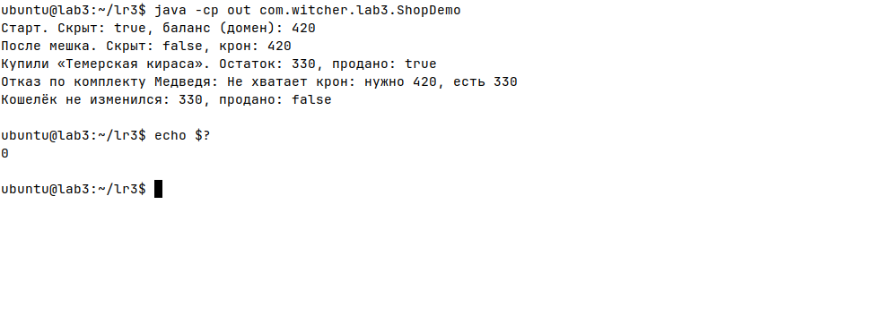
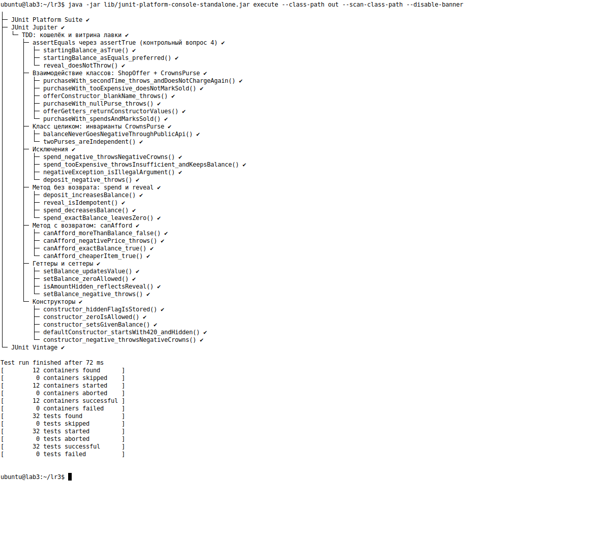

# ЛАБОРАТОРНАЯ РАБОТА № 3
## Разработка проекта на Java под управлением тестированием

**Проект (тема диплома):** THE WITCHER — интерактивная глава 1 «Петля герцога»  
**Учебный модуль:** кошелёк лавки (`CrownsPurse`) и товар витрины (`ShopOffer`)  
**Стиль:** TDD, OOP, Java 17, JUnit 5  
**Дата:** 19.09.2026

Код модуля и тестов — **только в этом отчёте**. В `dev/src` игры его пока не внедряем.

---

## Цель

Научиться разрабатывать проект в стиле объектно-ориентированного программирования на языке Java **под управлением тестированием** (Test-Driven Development, TDD).

---

# 1. Краткие теоретические сведения

**Разработка под управлением тестированием (TDD)** — техника, в которой код пишут короткими циклами, и **тест предшествует** реализации:

1. **Red** — пишем падающий тест (класса ещё нет или поведение неверное).
2. **Green** — пишем минимальный код, чтобы тест прошёл.
3. **Refactor** — убираем дубли, не меняя поведение. Все тесты снова зелёные.

Модульные тесты всегда должны проходить на **100 %**. Иначе есть *точно* неработоспособный код, который гарантированно даст дефект в приложении. Повторный успешный прогон после доработки показывает, что ничего не сломали.

Особенности модульных тестов:

- отделены от кода приложения на уровне структуры проекта (`src` / `test`);
- независимы друг от друга, атомарны, просты;
- часто пишутся программистами (нужно знать логику);
- **могут писаться до кода приложения**.

В рамках модульного тестирования проверкам подвергаются:

- метод;
- метод, который ничего не возвращает (`void`);
- класс;
- взаимодействие классов;
- геттеры и сеттеры;
- конструкторы;
- исключения.

Все эти варианты реализованы ниже.

---

# 2. Вариант: не «окружность из таблицы», а домен лавки

В методичке пример — класс «окружность»: одно поле, конструктор из радиуса/диаметра/длины/площади, геттер/сеттер, методы расчёта. Таблица 2 даёт учебные задачи (високосный год, четверть плоскости, треугольник).

Для дипломного проекта берём **тот же каркас OOP**, но объект из главы 1:

> Дан кошелёк Геральта. Известен стартовый гонорар **420 крон**. До катсцены мешка сумма скрыта. Можно узнать, хватает ли денег на товар, списать кроны, положить кроны, открыть сумму. Товар витрины покупается **из** кошелька: при успехе товар помечается проданным, при нехватке крон или повторной покупке — отказ.

Это прямой аналог примера «окружность»: одно главное поле (баланс), конструкторы, геттер/сеттер, вычисления, заполнение поля, плюс второй класс для **взаимодействия**.

Правила (оракул из лавки / лабораторных № 1–2):

| Правило | Ожидание |
|---|---|
| Конструктор по умолчанию | баланс 420, сумма скрыта |
| Баланс < 0 | `NegativeCrownsException` |
| `canAfford(price)` | `true`, если `balance >= price` |
| `spend(price)` | уменьшает баланс; при `price > balance` — `InsufficientCrownsException`, баланс не меняется |
| `reveal()` | `isAmountHidden() == false` |
| `ShopOffer.purchaseWith(purse)` | `purse.spend(price)` + `sold = true`; повтор — исключение |

Методов не меньше пяти: `getBalance`, `setBalance`, `canAfford`, `spend`, `deposit`, `reveal`, плюс конструкторы и `purchaseWith`.

---

# 3. Порядок TDD (как шли циклы)

Тесты писались **раньше** реализации. Ниже — сжатая запись циклов, не финальный код.

## Цикл 1. Конструктор (Red → Green)

Сначала тест, класса ещё нет — он не компилируется. Это и есть Red.

```java
@Test
void defaultConstructor_startsWith420_andHidden() {
    CrownsPurse purse = new CrownsPurse();
    assertEquals(420, purse.getBalance());
    assertTrue(purse.isAmountHidden());
}
```

Минимальный Green:

```java
public class CrownsPurse {
    private int balance = 420;
    private boolean amountHidden = true;
    public int getBalance() { return balance; }
    public boolean isAmountHidden() { return amountHidden; }
}
```

## Цикл 2. Исключение в конструкторе

```java
@Test
void constructor_negative_throwsNegativeCrowns() {
    assertThrows(NegativeCrownsException.class, () -> new CrownsPurse(-1));
}
```

Появляется проверка `if (startingBalance < 0) throw ...`.

## Цикл 3. Void-метод `spend`

Тест смотрит **побочный эффект** (баланс после вызова), а не возвращаемое значение — его нет.

```java
@Test
void spend_decreasesBalance() {
    CrownsPurse purse = new CrownsPurse(420, false);
    purse.spend(90);
    assertEquals(330, purse.getBalance());
}
```

## Цикл 4. Взаимодействие классов

```java
@Test
void purchaseWith_spendsAndMarksSold() {
    CrownsPurse purse = new CrownsPurse(420, false);
    ShopOffer offer = new ShopOffer("Темерская кираса", 90);
    offer.purchaseWith(purse);
    assertEquals(330, purse.getBalance());
    assertTrue(offer.isSold());
}
```

`ShopOffer` не копирует логику списания: он **вызывает** `purse.spend`. Тест проверяет, что два объекта договорились.

После каждого цикла гонялся весь набор: 100 % зелёных. Это и есть «ничего не сломали».

---

# 4. Программа (финальный код после рефакторинга)

Пакет учебный: `com.witcher.lab3`. В репозиторий игры не копировался.

## 4.1. Исключения

```java
package com.witcher.lab3;

public class NegativeCrownsException extends IllegalArgumentException {
    public NegativeCrownsException(int amount) {
        super("Отрицательная сумма крон недопустима: " + amount);
    }
}
```

```java
package com.witcher.lab3;

public class InsufficientCrownsException extends IllegalStateException {
    public InsufficientCrownsException(int balance, int price) {
        super("Не хватает крон: нужно " + price + ", есть " + balance);
    }
}
```

## 4.2. Класс `CrownsPurse`

```java
package com.witcher.lab3;

/**
 * Кошелёк Геральта в лавке главы 1.
 * Стартовый гонорар — 420 крон; до reveal сумма скрыта (в UI это «???»).
 */
public class CrownsPurse {

    public static final int STARTING_CROWNS = 420;

    private int balance;
    private boolean amountHidden;

    public CrownsPurse() {
        this(STARTING_CROWNS, true);
    }

    public CrownsPurse(int startingBalance) {
        this(startingBalance, true);
    }

    public CrownsPurse(int startingBalance, boolean amountHidden) {
        if (startingBalance < 0) {
            throw new NegativeCrownsException(startingBalance);
        }
        this.balance = startingBalance;
        this.amountHidden = amountHidden;
    }

    public int getBalance() {
        return balance;
    }

    public void setBalance(int balance) {
        if (balance < 0) {
            throw new NegativeCrownsException(balance);
        }
        this.balance = balance;
    }

    public boolean isAmountHidden() {
        return amountHidden;
    }

    /** Катсцена мешка: сумма становится видна. */
    public void reveal() {
        amountHidden = false;
    }

    public boolean canAfford(int price) {
        if (price < 0) {
            throw new NegativeCrownsException(price);
        }
        return balance >= price;
    }

    /** Списание крон. Ничего не возвращает — меняет состояние. */
    public void spend(int price) {
        if (price < 0) {
            throw new NegativeCrownsException(price);
        }
        if (balance < price) {
            throw new InsufficientCrownsException(balance, price);
        }
        balance -= price;
    }

    public void deposit(int amount) {
        if (amount < 0) {
            throw new NegativeCrownsException(amount);
        }
        balance += amount;
    }
}
```

## 4.3. Класс `ShopOffer` (взаимодействие)

```java
package com.witcher.lab3;

public class ShopOffer {

    private final String name;
    private final int price;
    private boolean sold;

    public ShopOffer(String name, int price) {
        if (name == null || name.isBlank()) {
            throw new IllegalArgumentException("У товара должно быть имя");
        }
        if (price < 0) {
            throw new NegativeCrownsException(price);
        }
        this.name = name;
        this.price = price;
    }

    public String getName() { return name; }
    public int getPrice() { return price; }
    public boolean isSold() { return sold; }

    public void purchaseWith(CrownsPurse purse) {
        if (purse == null) {
            throw new NullPointerException("Кошелёк не задан");
        }
        if (sold) {
            throw new IllegalStateException("Товара больше нет: " + name);
        }
        purse.spend(price);
        sold = true;
    }
}
```

## 4.4. Демонстрация работы программы

```java
package com.witcher.lab3;

public class ShopDemo {
    public static void main(String[] args) {
        CrownsPurse purse = new CrownsPurse();
        System.out.println("Старт. Скрыт: " + purse.isAmountHidden()
                + ", баланс (домен): " + purse.getBalance());
        purse.reveal();
        System.out.println("После мешка. Скрыт: " + purse.isAmountHidden()
                + ", крон: " + purse.getBalance());
        ShopOffer cuirass = new ShopOffer("Темерская кираса", 90);
        cuirass.purchaseWith(purse);
        System.out.println("Купили «" + cuirass.getName() + "». Остаток: "
                + purse.getBalance() + ", продано: " + cuirass.isSold());
        ShopOffer bearSet = new ShopOffer("Комплект школы Медведя", 420);
        try {
            bearSet.purchaseWith(purse);
        } catch (InsufficientCrownsException e) {
            System.out.println("Отказ по комплекту Медведя: " + e.getMessage());
            System.out.println("Кошелёк не изменился: " + purse.getBalance()
                    + ", продано: " + bearSet.isSold());
        }
    }
}
```

**Фактический вывод `ShopDemo`:**

```text
Старт. Скрыт: true, баланс (домен): 420
После мешка. Скрыт: false, крон: 420
Купили «Темерская кираса». Остаток: 330, продано: true
Отказ по комплекту Медведя: Не хватает крон: нужно 420, есть 330
Кошелёк не изменился: 330, продано: false
```

Это тот же негатив, что TC-04 в лабораторной № 1: после дешёвой покупки комплект за 420 уже не по карману, товар не помечен проданным.

**Скриншот вывода программы** (`ShopDemo`):



---

# 5. Модульные тесты

Ниже — полный учебный класс. Для отчёта важно, **какой вид проверки** закрывает каждая группа.

| Что требует методичка | Где в тестах |
|---|---|
| Метод | `canAfford`, `deposit` |
| Метод без возврата | `spend`, `reveal` — смотрим состояние после вызова |
| Класс | инварианты: баланс ≥ 0, два кошелька независимы |
| Взаимодействие классов | `ShopOffer.purchaseWith(CrownsPurse)` |
| Геттеры и сеттеры | `getBalance` / `setBalance`, `isAmountHidden` |
| Конструкторы | default 420, заданный баланс, отказ на −1 |
| Исключения | `NegativeCrownsException`, `InsufficientCrownsException`, повторная покупка |

```java
package com.witcher.lab3;

import org.junit.jupiter.api.BeforeEach;
import org.junit.jupiter.api.DisplayName;
import org.junit.jupiter.api.Nested;
import org.junit.jupiter.api.Test;

import static org.junit.jupiter.api.Assertions.assertDoesNotThrow;
import static org.junit.jupiter.api.Assertions.assertEquals;
import static org.junit.jupiter.api.Assertions.assertFalse;
import static org.junit.jupiter.api.Assertions.assertInstanceOf;
import static org.junit.jupiter.api.Assertions.assertNotSame;
import static org.junit.jupiter.api.Assertions.assertThrows;
import static org.junit.jupiter.api.Assertions.assertTrue;

@DisplayName("TDD: кошелёк и витрина лавки")
class CrownsPurseTddTest {

    @Nested
    @DisplayName("Конструкторы")
    class Constructors {

        @Test
        void defaultConstructor_startsWith420_andHidden() {
            CrownsPurse purse = new CrownsPurse();
            assertEquals(CrownsPurse.STARTING_CROWNS, purse.getBalance());
            assertTrue(purse.isAmountHidden());
        }

        @Test
        void constructor_setsGivenBalance() {
            assertEquals(100, new CrownsPurse(100).getBalance());
        }

        @Test
        void constructor_zeroIsAllowed() {
            assertEquals(0, new CrownsPurse(0).getBalance());
        }

        @Test
        void constructor_negative_throwsNegativeCrowns() {
            assertThrows(NegativeCrownsException.class, () -> new CrownsPurse(-1));
        }

        @Test
        void constructor_hiddenFlagIsStored() {
            assertFalse(new CrownsPurse(420, false).isAmountHidden());
        }
    }

    @Nested
    @DisplayName("Геттеры и сеттеры")
    class GettersSetters {

        @Test
        void setBalance_updatesValue() {
            CrownsPurse purse = new CrownsPurse(10);
            purse.setBalance(50);
            assertEquals(50, purse.getBalance());
        }

        @Test
        void setBalance_zeroAllowed() {
            CrownsPurse purse = new CrownsPurse(10);
            purse.setBalance(0);
            assertEquals(0, purse.getBalance());
        }

        @Test
        void setBalance_negative_throws() {
            CrownsPurse purse = new CrownsPurse(10);
            assertThrows(NegativeCrownsException.class, () -> purse.setBalance(-8));
            assertEquals(10, purse.getBalance());
        }

        @Test
        void isAmountHidden_reflectsReveal() {
            CrownsPurse purse = new CrownsPurse();
            assertTrue(purse.isAmountHidden());
            purse.reveal();
            assertFalse(purse.isAmountHidden());
        }
    }

    @Nested
    @DisplayName("Метод с возвратом: canAfford")
    class CanAfford {

        private CrownsPurse purse;

        @BeforeEach
        void setUp() {
            purse = new CrownsPurse(420, false);
        }

        @Test
        void canAfford_cheaperItem_true() {
            assertTrue(purse.canAfford(90));
        }

        @Test
        void canAfford_exactBalance_true() {
            assertTrue(purse.canAfford(420));
        }

        @Test
        void canAfford_moreThanBalance_false() {
            assertFalse(purse.canAfford(421));
        }

        @Test
        void canAfford_negativePrice_throws() {
            assertThrows(NegativeCrownsException.class, () -> purse.canAfford(-1));
        }
    }

    @Nested
    @DisplayName("Метод без возврата: spend и reveal")
    class VoidMethods {

        @Test
        void spend_decreasesBalance() {
            CrownsPurse purse = new CrownsPurse(420, false);
            purse.spend(90);
            assertEquals(330, purse.getBalance());
        }

        @Test
        void spend_exactBalance_leavesZero() {
            CrownsPurse purse = new CrownsPurse(420, false);
            purse.spend(420);
            assertEquals(0, purse.getBalance());
        }

        @Test
        void reveal_isIdempotent() {
            CrownsPurse purse = new CrownsPurse();
            purse.reveal();
            purse.reveal();
            assertFalse(purse.isAmountHidden());
        }

        @Test
        void deposit_increasesBalance() {
            CrownsPurse purse = new CrownsPurse(100, false);
            purse.deposit(20);
            assertEquals(120, purse.getBalance());
        }
    }

    @Nested
    @DisplayName("Исключения")
    class Exceptions {

        @Test
        void spend_tooExpensive_throwsInsufficient_andKeepsBalance() {
            CrownsPurse purse = new CrownsPurse(90, false);
            InsufficientCrownsException ex = assertThrows(
                    InsufficientCrownsException.class,
                    () -> purse.spend(420));
            assertTrue(ex.getMessage().contains("420"));
            assertEquals(90, purse.getBalance());
        }

        @Test
        void spend_negative_throwsNegativeCrowns() {
            CrownsPurse purse = new CrownsPurse(90, false);
            assertThrows(NegativeCrownsException.class, () -> purse.spend(-3));
            assertEquals(90, purse.getBalance());
        }

        @Test
        void deposit_negative_throws() {
            CrownsPurse purse = new CrownsPurse(90, false);
            assertThrows(NegativeCrownsException.class, () -> purse.deposit(-1));
        }

        @Test
        void negativeException_isIllegalArgument() {
            assertInstanceOf(IllegalArgumentException.class,
                    new NegativeCrownsException(-5));
        }
    }

    @Nested
    @DisplayName("Класс целиком: инварианты CrownsPurse")
    class ClassInvariants {

        @Test
        void balanceNeverGoesNegativeThroughPublicApi() {
            CrownsPurse purse = new CrownsPurse(50, false);
            assertThrows(InsufficientCrownsException.class, () -> purse.spend(51));
            assertThrows(NegativeCrownsException.class, () -> purse.setBalance(-1));
            assertTrue(purse.getBalance() >= 0);
        }

        @Test
        void twoPurses_areIndependent() {
            CrownsPurse a = new CrownsPurse(100, false);
            CrownsPurse b = new CrownsPurse(100, false);
            a.spend(40);
            assertEquals(60, a.getBalance());
            assertEquals(100, b.getBalance());
            assertNotSame(a, b);
        }
    }

    @Nested
    @DisplayName("Взаимодействие классов: ShopOffer + CrownsPurse")
    class ClassInteraction {

        private CrownsPurse purse;

        @BeforeEach
        void setUp() {
            purse = new CrownsPurse(420, false);
        }

        @Test
        void purchaseWith_spendsAndMarksSold() {
            ShopOffer offer = new ShopOffer("Темерская кираса", 90);
            offer.purchaseWith(purse);
            assertEquals(330, purse.getBalance());
            assertTrue(offer.isSold());
        }

        @Test
        void purchaseWith_secondTime_throws_andDoesNotChargeAgain() {
            ShopOffer offer = new ShopOffer("Темерская кираса", 90);
            offer.purchaseWith(purse);
            assertThrows(IllegalStateException.class, () -> offer.purchaseWith(purse));
            assertEquals(330, purse.getBalance());
        }

        @Test
        void purchaseWith_tooExpensive_doesNotMarkSold() {
            ShopOffer bear = new ShopOffer("Комплект школы Медведя", 420);
            purse.spend(90);
            assertThrows(InsufficientCrownsException.class, () -> bear.purchaseWith(purse));
            assertFalse(bear.isSold());
            assertEquals(330, purse.getBalance());
        }

        @Test
        void purchaseWith_nullPurse_throws() {
            ShopOffer offer = new ShopOffer("Зелье", 48);
            assertThrows(NullPointerException.class, () -> offer.purchaseWith(null));
            assertFalse(offer.isSold());
        }

        @Test
        void offerConstructor_blankName_throws() {
            assertThrows(IllegalArgumentException.class, () -> new ShopOffer("  ", 10));
        }

        @Test
        void offerGetters_returnConstructorValues() {
            ShopOffer offer = new ShopOffer("Серебряный меч", 198);
            assertEquals("Серебряный меч", offer.getName());
            assertEquals(198, offer.getPrice());
            assertFalse(offer.isSold());
        }
    }

    @Nested
    @DisplayName("assertEquals через assertTrue")
    class AssertEqualsViaAssertTrue {

        @Test
        void startingBalance_asTrue() {
            CrownsPurse purse = new CrownsPurse();
            assertTrue(purse.getBalance() == CrownsPurse.STARTING_CROWNS);
        }

        @Test
        void startingBalance_asEquals_preferred() {
            CrownsPurse purse = new CrownsPurse();
            assertEquals(CrownsPurse.STARTING_CROWNS, purse.getBalance());
        }

        @Test
        void reveal_doesNotThrow() {
            CrownsPurse purse = new CrownsPurse();
            assertDoesNotThrow(purse::reveal);
        }
    }
}
```

---

# 6. Результаты тестирования

Прогон JUnit 5 (учебная сборка отдельно от игры, в репозиторий не входила):

```text
Test run finished after 103 ms
[        12 containers found      ]
[        12 containers successful ]
[        32 tests found           ]
[        32 tests started         ]
[        32 tests successful      ]
[         0 tests failed          ]
```

**32 / 32 = 100 %.** Красных тестов нет — иначе, по методичке, в модуле был бы точно дефектный код.

**Скриншот результатов тестирования** (JUnit 5):



Связь с лабораторной № 2: граница `canAfford(420)` / `canAfford(421)` — то же семейство, что «ровно MIN_PRICE» и «на единицу меньше». Связь с лабораторной № 1: повтор `purchaseWith` — идея TC-04 «товара больше нет».

---

# Выводы

TDD меняет порядок: сначала фиксируется ожидаемое поведение тестом, потом появляется код. Пока набор не зелёный на 100 %, модуль нельзя считать готовым; повторный зелёный прогон после правки — доказательство, что старые инварианты живы.

В рамках модульного тестирования проверяют не «игру целиком», а атомарные элементы. **Метод с возвратом** — например `canAfford(90)` при балансе 420 даёт `true`, а `canAfford(421)` — `false`. **Метод без возврата** проверяют по следу: после `spend(90)` баланс 330. **Конструктор** проверяют по начальному состоянию (420 и скрытая сумма) и по отказу на −1, а не фразой «вернулся объект класса CrownsPurse» — это уже гарантия языка. **Сеттер** имеет смысл, когда в нём есть правило: `setBalance(-8)` бросает исключение и **не** портит старое значение. Пустой `getX`/`setX` без логики юнитом обычно не окупается. **Исключение** проверяют типом (`InsufficientCrownsException`) и тем, что состояние не изменилось. **Взаимодействие классов** — это не два теста подряд, а один сценарий: `ShopOffer.purchaseWith` должен и списать кроны, и пометить товар; если крон не хватило, `isSold()` остаётся `false`.

Внешние источники (файл сохранения, Swing, случайный кубик боя) в юнит не тащат: их подменяют заглушкой или выносят за границу метода. Иначе тест перестаёт быть атомарным.

---

# Контрольные вопросы

**1. Что необходимо делать, если в рамках модульного тестирования необходимо проверить действие, опирающееся на внешние источники или приёмники данных?**  
Не ходить в реальный файл, сеть, БД или окно игры. Внешнюю зависимость подменяют тестовым двойником (заглушка / mock), либо выносят I/O на край, а юнитом проверяют чистую логику. Пример: `CrownsPurse.spend` не читает `saves/chapter1_session.properties` и не рисует мешок — только числа. Сохранение — уже не этот уровень.

**2. Нужно ли проверять, что операция создания экземпляра класса вернула экземпляр нужного класса?**  
Как правило нет: `new CrownsPurse()` по языку и так даёт `CrownsPurse`. Полезно проверять **состояние после конструктора** (баланс 420, скрыт) и **исключение на неверных аргументах** (`new CrownsPurse(-1)`). `assertTrue(purse instanceof CrownsPurse)` почти ничего не ловит.

**3. Для чего используются аннотации в JUnit?**  
Помечают, что является тестом и как устроен жизненный цикл: `@Test` — метод-проверка, `@BeforeEach` — подготовка (новый кошелёк на 420), `@Nested` / `@DisplayName` — группы в отчёте. Без `@Test` обычный метод JUnit не запустит.

**4. Как проверку `assertEquals` можно заменить проверкой `assertTrue`?**  
`assertEquals(420, purse.getBalance())` ≈ `assertTrue(purse.getBalance() == 420)` для примитивов или `assertTrue(expected.equals(actual))` для объектов. `assertEquals` лучше: в падении видны оба значения. Поэтому в наборе оставлены оба варианта — как иллюстрация, не как рекомендация заменить всё на `assertTrue`.

**5. Имеет ли смысл проверять модульными тестами геттеры и сеттеры?**  
Если сеттер только пишет поле, а геттер только читает — ценность низкая, это не ловит дефекты. Если есть валидация — да. У нас `setBalance(-8)` обязан бросить `NegativeCrownsException` и оставить старый баланс; без теста это правило легко стереть при рефакторинге. Методичка на этом этапе просит закрыть и геттеры/сеттеры, поэтому простые присвоения тоже есть, но осмысленная часть — именно отказ на отрицательное.

---

## Источники

1. Методические указания к лабораторной работе № 3 «Разработка проекта на Java под управлением тестированием».
2. Куликов С. С. *Автоматизированное тестирование*, разд. 4.4. Разработка под управлением тестированием.
3. Лабораторные № 1–2: кошелёк 420, TC-04 (повтор товара / нехватка крон), граница «цена = баланс».
4. JUnit 5 (`org.junit.jupiter.api`).
