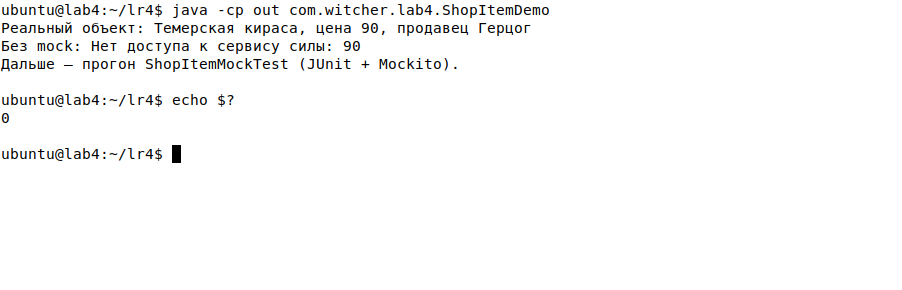
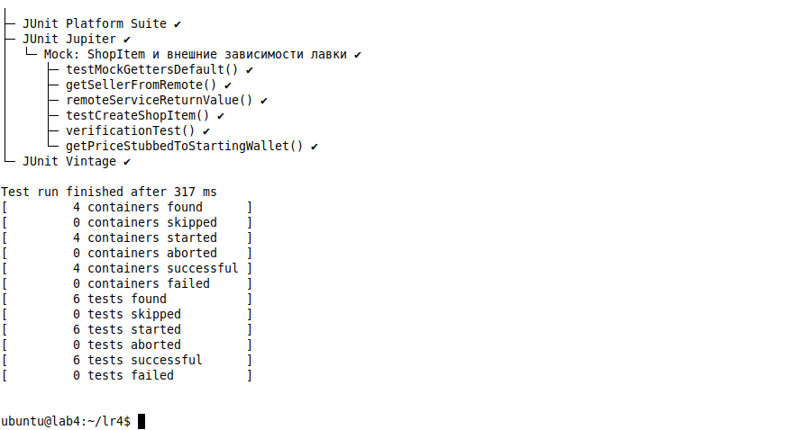

# ЛАБОРАТОРНАЯ РАБОТА № 4
## Тестирование внешних зависимостей, использование jMock / Mockito

**Проект (тема диплома):** THE WITCHER — интерактивная глава 1 «Петля герцога»  
**Учебный объект:** `ShopItem` (товар лавки) — аналог класса `Car` из методички  
**Стек:** Java 17, JUnit 5, Mockito (расширение JUnit для mock; в методичке — jMock)  
**Дата:** 26.09.2026

Код и тесты — **только в этом отчёте**. В `dev/src` игры не внедряем.

---

## Цель

Изучить возможности тестирования внешних зависимостей в модульных тестах с помощью **Mock-объектов**.

---

# 1. Краткие теоретические сведения

**Внешняя зависимость** — то, что находится вне нашего контроля во время выполнения теста. Например: база данных, веб-сервис, сторонняя библиотека. Без контроля над зависимостью нельзя гарантированно проверить поведение приложения.

```text
Приложение ──запрос──► СУБД
Как проверить запрос, не имея доступа к СУБД?

Приложение ──запрос──► наш специальный объект (mock)
Из него тест может запросить любые данные.
```

**Mock-объекты** (англ. *mock* — подделка) имеют тот же интерфейс, что и компоненты приложения, но **полностью управляются из теста**. Плюсы:

1. не нужна вся инфраструктура (живая БД, сеть, сервис силы снаряжения);
2. можно проверить, что код вызвал нужные методы mock-а с нужными аргументами.

В методичке для Java указан **jMock** (расширение JUnit). В примерах лабораторной и в современной практике тот же сценарий показывают через **Mockito** (`mock`, `when`, `verify`) — синтаксис проще, идея та же: подмена внешней среды.

---

# 2. Объект тестирования (наш вариант вместо Car)

В методичке — класс `Car` (марка, год, владелец) с запросом к несуществующей БД и к ресурсу скорости.

Для главы 1 берём **товар лавки**:

| Car (методичка) | ShopItem (наш проект) |
|---|---|
| `marka` | `name` — «Темерская кираса» |
| `year` | `price` — цена в кронах |
| `owner` | `seller` — «Герцог» |
| `requestOwnerToCar` → БД | `requestOwnerFromDb` → БД (нет) |
| `calcPowerToSpped` → сервис | `calcPowerFromPrice` → сервис силы (нет) |

Внешняя зависимость здесь — **СУБД / удалённый сервис**, которого в юнит-тесте нет. Без mock вызов `calcPowerFromPrice` падает: «Нет доступа к сервису силы». С mock тест сам задаёт ответ.

---

# 3. Программа

```java
package com.witcher.lab4;

/**
 * Товар лавки Герцога — аналог класса Car из методички.
 * Часть данных приходит из «внешней среды» (БД / удалённый сервис).
 */
public class ShopItem {

    private String name;
    private int price;
    private String seller;

    public ShopItem(String name, int price, String seller) {
        this.name = name;
        this.price = price;
        this.seller = seller;
    }

    public String getName() {
        return name;
    }

    public int getPrice() {
        return price;
    }

    public String getSeller() {
        return seller;
    }

    /** Запрос к БД, которая не существует в юнит-тесте. */
    private String requestOwnerFromDb(String seller) {
        String owner = request(seller);
        return owner;
    }

    /** Запрос к ресурсу, который считает «силу» комплекта по цене. */
    public int calcPowerFromPrice(int crowns) {
        int power = request(crowns);
        return power;
    }

    protected String request(String seller) {
        throw new UnsupportedOperationException("Нет доступа к СУБД: " + seller);
    }

    protected int request(int crowns) {
        throw new UnsupportedOperationException("Нет доступа к сервису силы: " + crowns);
    }
}
```

Демонстрация без mock:

```java
package com.witcher.lab4;

public class ShopItemDemo {
    public static void main(String[] args) {
        ShopItem real = new ShopItem("Темерская кираса", 90, "Герцог");
        System.out.println("Реальный объект: " + real.getName()
                + ", цена " + real.getPrice()
                + ", продавец " + real.getSeller());
        try {
            real.calcPowerFromPrice(90);
        } catch (UnsupportedOperationException e) {
            System.out.println("Без mock: " + e.getMessage());
        }
        System.out.println("Дальше — прогон ShopItemMockTest (JUnit + Mockito).");
    }
}
```

**Фактический вывод `ShopItemDemo`:**

```text
Реальный объект: Темерская кираса, цена 90, продавец Герцог
Без mock: Нет доступа к сервису силы: 90
Дальше — прогон ShopItemMockTest (JUnit + Mockito).
```



---

# 4. Модульные тесты внешних зависимостей

По содержанию отчёта методички нужно проверить:

1. конструктор;
2. геттеры;
3. метод, возвращающий значение, заданное тестировщиком (`when` / `thenReturn`);
4. вызывались ли определённые методы (`verify`).

**Каждую проверку — в отдельном тесте.**

```java
package com.witcher.lab4;

import org.junit.jupiter.api.BeforeEach;
import org.junit.jupiter.api.DisplayName;
import org.junit.jupiter.api.Test;

import static org.junit.jupiter.api.Assertions.assertEquals;
import static org.junit.jupiter.api.Assertions.assertNull;
import static org.mockito.Mockito.mock;
import static org.mockito.Mockito.only;
import static org.mockito.Mockito.verify;
import static org.mockito.Mockito.when;

@DisplayName("Mock: ShopItem и внешние зависимости лавки")
class ShopItemMockTest {

    private ShopItem mockedItem;

    @BeforeEach
    void setUp() {
        mockedItem = mock(ShopItem.class);
    }

    /** 1. Конструктор реального объекта (без внешней среды). */
    @Test
    void testCreateShopItem() {
        ShopItem item = new ShopItem("Темерская кираса", 90, "Герцог");
        assertEquals("Темерская кираса", item.getName());
        assertEquals(90, item.getPrice());
        assertEquals("Герцог", item.getSeller());
    }

    /**
     * 2. Геттеры mock-объекта: без when строки — null, число — 0
     * (как в методичке для Car: marka=null, year=0).
     */
    @Test
    void testMockGettersDefault() {
        ShopItem newItem = mock(ShopItem.class);
        assertNull(newItem.getName());
        assertEquals(0, newItem.getPrice());
        assertNull(newItem.getSeller());
    }

    /**
     * 3. Метод возвращает значение, заданное тестировщиком.
     * Аналог remoteServissReturnValue — без реального сервиса силы.
     * В методичке опечатка в assert (вход 250 вместо 120); здесь оракул согласован с when.
     */
    @Test
    void remoteServiceReturnValue() {
        when(mockedItem.calcPowerFromPrice(120)).thenReturn(250);
        assertEquals(250, mockedItem.calcPowerFromPrice(120));
    }

    /**
     * 4. Эмуляция ответа «удалённого» продавца (как getOwner → "Mercedes").
     */
    @Test
    void getSellerFromRemote() {
        when(mockedItem.getSeller()).thenReturn("Герцог Арнскрон");
        assertEquals("Герцог Арнскрон", mockedItem.getSeller());
    }

    /**
     * 5. verify: проверяем не только результат, но и путь к нему.
     * only() — ровно один вызов getName().
     */
    @Test
    void verificationTest() {
        String name = mockedItem.getName();
        assertNull(name);
        verify(mockedItem, only()).getName();
    }

    /** Дополнительно: цена = стартовый кошелёк 420 крон. */
    @Test
    void getPriceStubbedToStartingWallet() {
        when(mockedItem.getPrice()).thenReturn(420);
        assertEquals(420, mockedItem.getPrice());
    }
}
```

### Что делает каждый тест

| Тест | Вид проверки | Смысл |
|---|---|---|
| `testCreateShopItem` | конструктор | реальный объект без СУБД |
| `testMockGettersDefault` | геттеры | у «пустого» mock: null / 0 |
| `remoteServiceReturnValue` | заданный возврат | `when(...).thenReturn(250)` вместо сервиса |
| `getSellerFromRemote` | remote | продавец «подставлен» тестом |
| `verificationTest` | `verify` | метод `getName` реально вызывался |
| `getPriceStubbedToStartingWallet` | stub | цена 420 без БД |

---

# 5. Результаты тестирования

Прогон JUnit 5 + Mockito (учебная сборка отдельно от игры):

```text
Test run finished after 493 ms
[         4 containers successful ]
[         6 tests found           ]
[         6 tests successful      ]
[         0 tests failed          ]
```

**6 / 6 = 100 %.**



Без mock реальный `calcPowerFromPrice(90)` падает — это как раз ответ на вопрос методички: «как проверить запрос, не имея СУБД?» — подменить зависимость mock-ом и задать ответ через `when`.

---

# Выводы

Внешняя зависимость (БД, веб-сервис, чужая библиотека) неподконтрольна тесту: без неё нельзя гарантировать поведение. **Mock** — объект с тем же API, но управляемый из теста: не нужна живая инфраструктура, можно задать любой возврат и проверить, какие методы вызывались.

Для лавки главы 1 «сервис силы» и «БД владельца» в юните недоступны. `when(item.calcPowerFromPrice(120)).thenReturn(250)` подменяет удалённый ресурс. `verify(item, only()).getName()` проверяет не только `assertEquals`, но и **как** до результата дошли — вызывался ли нужный метод. Конструктор и геттеры реального `ShopItem` проверяют домен без сети; дефолты mock (`null` / `0`) показывают, что без `when` Mockito не ходит во внешнюю среду.

Модульные тесты рекомендуется писать **атомарными, независимыми, изолированными**: один тест — одна проверка, без общей живой БД, с подменой внешних краёв. Тогда падение сразу указывает на конкретное правило, а не на «сеть отвалилась».

---

# Контрольные вопросы

**1. Какими рекомендуется создавать модульные тесты?**  
Атомарными, независимыми друг от друга, изолированными от внешней среды (БД, сеть, файлы). Один тест — одна проверка. Внешние зависимости подменяют mock/stub. Тесты отделяют от кода приложения (`src` / `test`) и гоняют до изменений в проде.

**2. Можно ли с помощью jMock (Mockito) проэмулировать поведение класса, реализующего взаимодействие с внешней средой?**  
Да. Именно для этого mock и нужен: класс «как будто» ходит в СУБД или сервис, а тест задаёт ответы через `when` / ожидания jMock, не поднимая реальную инфраструктуру. У нас так эмулирован `calcPowerFromPrice` и продавец.

**3. Можно ли проэмулировать сущность с помощью jMock, если уже написан реально существующий класс для этой сущности?**  
Да. Mock создаётся **по типу** существующего класса или интерфейса (`mock(ShopItem.class)`). Реальный класс может уже быть в проекте; mock не заменяет прод-код навсегда, а подменяет его **только в тесте**. Реальный `ShopItem` с конструктором мы тоже тестируем отдельно.

**4. В каких условиях применять mock-объекты и писать модульные тесты проще?**  
Когда логика отделена от инфраструктуры: есть интерфейс/методы, которые можно подменить; нет жёсткой привязки к статическим вызовам СУБД внутри private без швов. Проще всего — если внешняя зависимость инжектируется (или вынесена в `protected`/`interface`), а домен чистый. Тогда mock пишется быстро, а тест остаётся стабильным.

---

## Источники

1. Методические указания к лабораторной работе № 4 «Тестирование внешних зависимостей, использование jMock».
2. Пример методички: класс `Car`, тесты с `Mockito.mock`, `when`, `verify`.
3. Mockito / jMock — расширения JUnit для mock-объектов.
4. Лабораторные № 1–3: лавка, 420 крон, `ShopOffer` / кошелёк как домен без Swing.
